## 前言
 minecraft 後台管理輔助

## Google認證設定
 * https://console.cloud.google.com/apis/credentials
 
 * webstie.conf 環境變數設定檔中設定
    1. google_oauth2_clientID=``你的clientID``
    2. google_oauth2_secret_code=``你的secret_code``
    3. google_oauth2_callback_apiname=callback
    5. 添加 add_google_email=``管理員的gmail``

## 建置設定(Build Setup)
部屬所需檔案皆在目錄``./build/``內
1. 檢視``./build/config/webstie.conf``並作設定適當參數
2. 設置``./build/config/delete_mods_script.sh``設置刪除minecraft模組腳本
3. 設置``./build/config/restart_script.sh``設置重啟minecraft腳本
4. 設置``./build/config/stop_script.sh``設置暫停minecraft腳本
5. 設置``./build/config/*.sh``設置暫停其他腳本(需要具備執行權限(555))
4. 設定``./build/website/Download/*``需要具備寫入權限(755)
5. 執行``./build/minecraft-control-panel``

## 檔案樹說明
```bash
├── build #專案執行檔放置處(包括環境設定檔、網頁版模)
│   ├── configs #參照./configs
│   │   ├── delete_mods_script.sh #刪除minecraft模組伺服器.sh腳本
│   │   ├── restart_script.sh #重啟minecraft伺服器.sh腳本
│   │   └── webstie.conf #環境變數設定檔
│   ├── configs #參照./website
│   └── minecraft-control-panel #執行檔
├── configs #專案設定檔
├── deploy #容器化專案所需檔案放置處,如:docker-compose.yml(暫時取消不使用)
├── go.mod #golang版控相關
├── go.sum #golang版控相關
├── internal #golang main() 私有pkg 
│   ├── common #golang 常用函式pkg
│   │   ├── common.go
│   │   └── customVar #golang 環境變數型別轉換模組
│   ├── controllers
│   │   ├── encrypt #golang 加密核心模組pkg
│   │   ├── googleOauth2 #golang google帳號認證模組pkg
│   │   ├── middleware
│   │   │   └── antiflood #antiflood模組
│   │   ├── minecraft #golang minecraft相關處理核心模組pkg
│   │   ├── web_handle.go #golang API接口對接模組pkg
│   │   └── web_templates.go
│   ├── global #golang 公用全域變數pkg
│   └── system #golang OS系統設置模組pkg
│
├── main.go #golang main()整體專案入口
├── pkg #golang main() 公有pkg 
│ 
├── runBuild.sh #build執行檔腳本（檔案輸出至./build）
└── website #網頁版模與靜態資源
    ├── downloads #下載清單檔案放置處(壓縮檔也放置此)
    ├── images #網頁公用靜態資源 - 圖片
    │   └── gabo.png
    ├── others #網頁公用靜態資源 - 其他檔案分類
    ├── pages #網頁公用靜態資源 - 純html頁面
    │   └── index-Menu.html #靜態首頁
    └── templates #網頁公用靜態資源 -版模

```

## API接口簡介
```bash
	/         #GET 根目錄將自動轉跳/login?state=indexMenu (靜態首頁)
	/login	  #GET&POST 登陸api接口,所有網頁服務必需通過此接口
	/callback #GET 驗證客戶端獲得的GoogleOauth2認證碼,並藉由Query:'state' 作為Param後開始後續使用服務
	/upload   #POST 上傳檔案接口,上傳過程包含Token驗證,同時間只能容許一位使用者操作
```

## google Oauth2 原理
 
